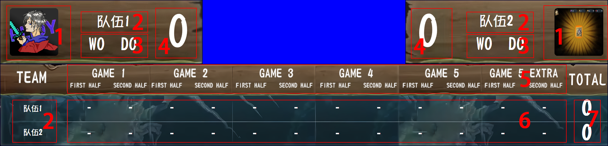
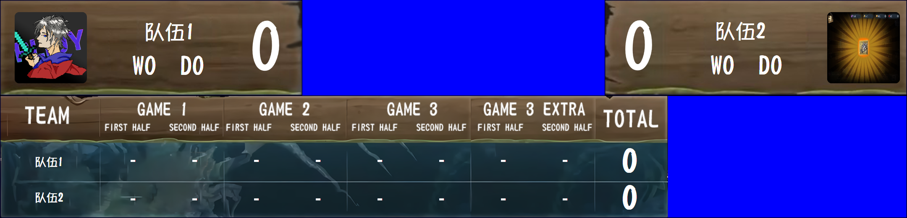

比分组件的功能是在局内的左上角和右上角显示当局小比分和双方胜平数以及再赛后显示双方每一轮的小分。

本软件同时支持BO3模式和BO5模式，切换方法详见[1.1.3 对局信息及导航](../1.1_后台控制窗口/1.1.3_对局信息及导航.md)。

下图为组件样式

> 由于BO3模式与BO5模式中的窗口控件几乎完全相同，我们仅为BO5模式下的控件功能做描述
>

以下是不同控件的功能：

1. 双方队徽
2. 双方战队名
3. 双方胜平数
4. 当局小比分
5. 对局进度
6. 不同对局进度的得分情况
7. 双方小分总和

> 如果看到这里的你打算提交诸如“比分组件合在一起无法使用”的issue或在群内问类似问题的话，建议搜索OBS的裁剪画面。
>

