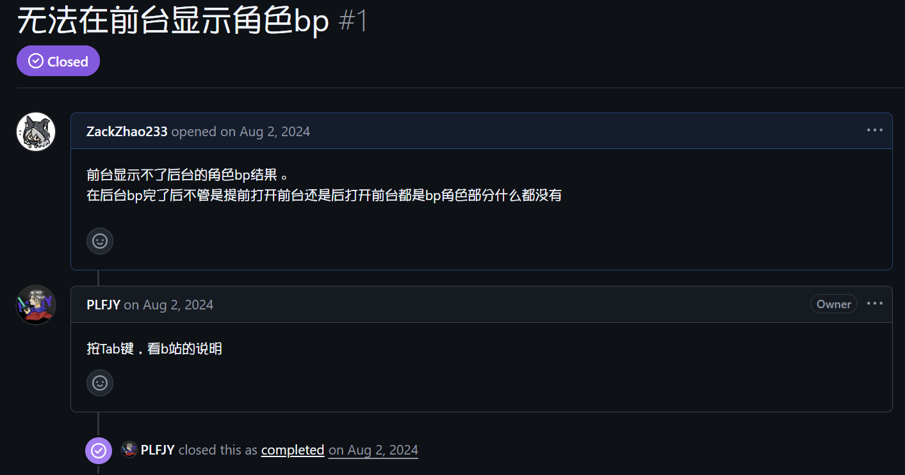

本软件基于GPL-3.0协议开源，**完全免费**。

## 如果你是付费购买的此软件，那么你一定是被骗了！！！
## 如果你是付费购买的此软件，那么你一定是被骗了！！！
## 如果你是付费购买的此软件，那么你一定是被骗了！！！
‍
**如果遇到前台控件错误或者消失请前往[前台管理](2._页面/2.10_前台管理.md)页面重置配置，这可能是由于上一个版本留下的默认配置导致的Bug**

官网地址 (基于Cloudflare Pages部署)：[https://bpsys.plfjy.top/](https://bpsys.plfjy.top/)

备用地址 (基于Github Pages部署): [https://plfjy.github.io/neo-bpsys-website/](https://plfjy.github.io/neo-bpsys-website/)

项目地址：[https://github.com/PLFJY/neo-bpsys-wpf/](https://github.com/PLFJY/neo-bpsys-wpf/)

作者QQ：3424127335

QQ交流群号：175741665

‍

**温馨提醒，在GitHub上提交issue或在群内反馈问题前请一定认真检查一下是软件的问题还是眼神或脑子的问题，否则我们的断档S1记录员将记录下您的黑历史并使其成为我们未来几个月甚至几年的笑料 。**

↓以下是一个唐诗issue的示例↓

以下是合作开发者列表：

- Zack (本文档撰写者)

