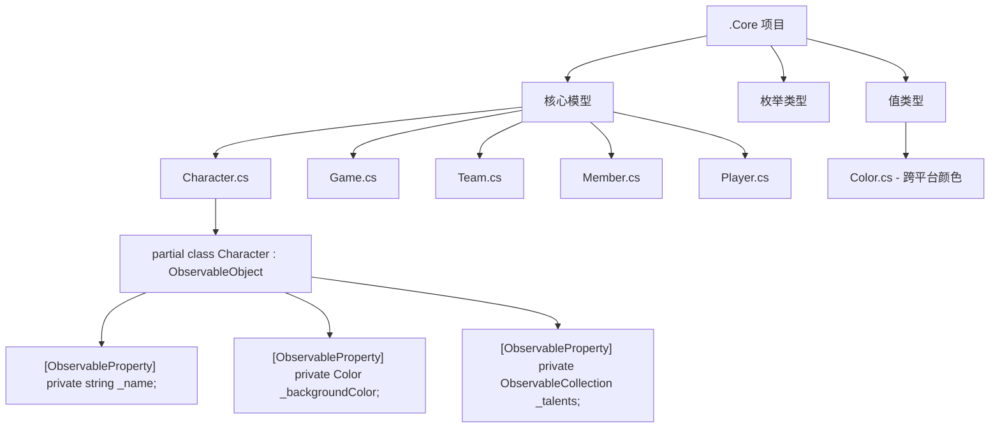
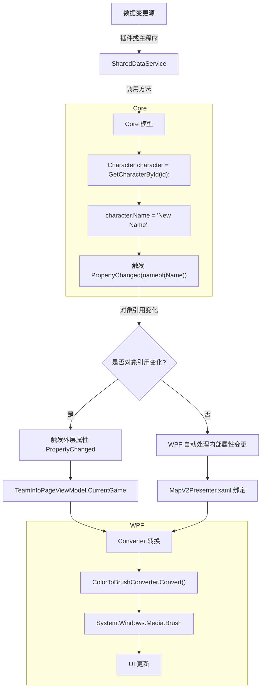
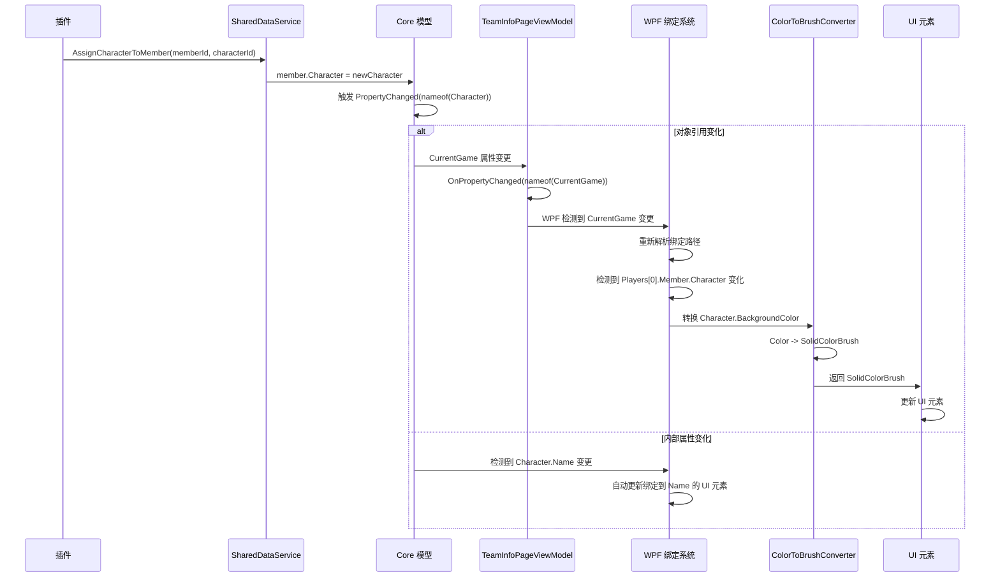

# NeoBpSys 核心数据流架构：完整流程梳理

基于您提供的项目结构和我们讨论的内容，我为您整理了完整的数据流流程。以下是详细的流程梳理和可视化流程图。

## 整体架构概览

```
┌─────────────────────────────────────────────────────────────────────────────────────────────┐
│                                     NeoBpSys.Core (跨平台)                                  │
│                                                                                           │
│  ┌─────────────┐     ┌──────────┐     ┌─────────────┐     ┌──────────────┐     ┌───────┐  │
│  │   Models    │────▶│  Enums   │────▶│ ValueTypes  │────▶│  Interfaces  │────▶│ Events│  │
│  └─────────────┘     └──────────┘     └─────────────┘     └──────────────┘     └───────┘  │
│         │                                                                 ▲               │
│         │                                                                 │               │
│         ▼                                                                 │               │
│  ┌─────────────────────┐                                                  │               │
│  │  Core Business Logic│◀─────────────────────────────────────────────────┘               │
│  └─────────────────────┘                                                                  │
└─────────────────────────────────────────────────────────────────────────────────────────────┘
                         ▲                                  │
                         │                                  │
                         │                                  ▼
┌─────────────────────────────────────────────────────────────────────────────────────────────┐
│                                  NeoBpSys (WPF 主项目)                                      │
│                                                                                           │
│  ┌─────────────┐     ┌──────────────┐     ┌─────────────┐     ┌───────────────────┐       │
│  │  ViewModels │────▶│     Views    │────▶│ Converters  │────▶│   UI Controls     │       │
│  └─────────────┘     └──────────────┘     └─────────────┘     └───────────────────┘       │
│         ▲                                                                             │
│         │                                                                             │
│         └─────────────────────────────────────────────────────────────────────────────┘
└─────────────────────────────────────────────────────────────────────────────────────────────┘
                         ▲
                         │
                         │
┌─────────────────────────────────────────────────────────────────────────────────────────────┐
│                                  插件系统 (Plugin)                                          │
│                                                                                           │
│  ┌─────────────┐     ┌───────────────────┐                                                │
│  │   Plugins   │────▶│ ISharedDataService│─────────────────────────────────────────────────▶│
│  └─────────────┘     └───────────────────┘                                                │
└─────────────────────────────────────────────────────────────────────────────────────────────┘
```

## 详细数据流流程

### 1. 数据结构定义（.Core 项目）



### 2. 数据变更流程



### 3. 完整数据变更到UI更新流程



## 具体实现步骤

### 1. .Core 项目结构

```
NeoBpSys.Core/
├─ Entities/
│   ├─ Character/
│   │   ├─ Character.cs       // 保留ObservableObject
│   │   ├─ Talent.cs          // 保留ObservableObject
│   │   └─ ...
│   ├─ Game/
│   │   ├─ Game.cs            // 保留ObservableObject
│   │   ├─ Player.cs          // 保留ObservableObject
│   │   ├─ Score.cs           // 保留ObservableObject
│   │   └─ ...
│   └─ Teams/
│       ├─ Team.cs            // 保留ObservableObject
│       ├─ Member.cs          // 保留ObservableObject
│       └─ ...
├─ Enums/
│   ├─ BanListName.cs
│   ├─ Camp.cs
│   ├─ GameAction.cs
│   └─ ...  // 从您项目中的Enums迁移
├─ ValueTypes/
│   └─ Color.cs               // 跨平台Color实现
└─ Services/
    └─ ISharedDataService.cs  // 仅定义接口
```

### 2. 数据流关键点说明

#### a) 对象引用变化处理（如更换Character）

```csharp
// SharedDataService.cs
public void AssignCharacterToMember(Guid memberId, Guid characterId)
{
    var member = GetMemberById(memberId);
    var oldCharacter = member.Character;
    var newCharacter = GetCharacterById(characterId);
    
    if (oldCharacter != newCharacter)
    {
        member.Character = newCharacter;
        // 触发Member.Character的PropertyChanged
        // WPF会自动更新绑定到Member.Character的所有UI
    }
}
```

```csharp
// TeamInfoPageViewModel.cs
// 不需要特殊处理 - WPF会自动更新{Binding Players[0].Member.Character.Name}
```

#### b) 对象替换处理（如更换CurrentGame）

```csharp
// SharedDataService.cs
private Game _currentGame;
public event EventHandler CurrentGameChanged;

public Game CurrentGame
{
    get => _currentGame;
    set
    {
        if (_currentGame != value)
        {
            _currentGame = value;
            CurrentGameChanged?.Invoke(this, EventArgs.Empty);
        }
    }
}

public void StartNewGame()
{
    CurrentGame = new Game(); // 会触发CurrentGameChanged
}
```

```csharp
// TeamInfoPageViewModel.cs
public TeamInfoPageViewModel(ISharedDataService sharedData)
{
    _sharedData = sharedData;
    _sharedData.CurrentGameChanged += (s, e) => 
        OnPropertyChanged(nameof(CurrentGame));
}

public Game CurrentGame => _sharedData.CurrentGame;
```

```xaml
<!-- TeamInfoPage.xaml -->
<TextBlock Text="{Binding CurrentGame.Players[0].Member.Character.Name}"/>
<!-- 当CurrentGame对象被替换时，会重新解析整个绑定路径 -->
```

#### c) 跨平台Color处理

```csharp
// .Core/ValueTypes/Color.cs
public readonly struct Color
{
    public byte R { get; }
    public byte G { get; }
    public byte B { get; }
    public byte A { get; }
    
    public Color(byte r, byte g, byte b, byte a = 255)
    {
        R = r;
        G = g;
        B = b;
        A = a;
    }
    
    // 常用颜色
    public static Color Red => new Color(255, 0, 0);
    // ...
}
```

```csharp
// .Core/Entities/Character/Character.cs
public partial class Character : ObservableObject
{
    [ObservableProperty]
    private Color _backgroundColor;  // 使用跨平台Color
}
```

```csharp
// 主项目/Converters/ColorToBrushConverter.cs
public class ColorToBrushConverter : IValueConverter
{
    public object Convert(object value, Type targetType, 
        object parameter, CultureInfo culture)
    {
        if (value is Color coreColor)
        {
            return new SolidColorBrush(
                System.Windows.Media.Color.FromArgb(
                    coreColor.A, coreColor.R, coreColor.G, coreColor.B));
        }
        return Brushes.Transparent;
    }
    
    // ConvertBack 实现...
}
```

```xaml
<!-- TeamInfoPage.xaml -->
<Border Background="{Binding CurrentGame.Players[0].Member.Character.BackgroundColor, 
                    Converter={StaticResource ColorToBrushConverter}}"/>
```

### 3. Message系统迁移路径

| 旧Message | 新机制 | 迁移步骤 |
|----------|--------|---------|
| `NewGameMessage` | `SharedDataService.CurrentGameChanged` | 1. 在SharedDataService中添加CurrentGameChanged事件<br>2. 将Messenger.Send替换为SharedDataService.StartNewGame() |
| `CharacterSwappedMessage` | `Member.Character` PropertyChanged | 1. 移除Message发送<br>2. 确保Character属性正确触发PropertyChanged |
| `MemberPropertyChangedMessage` | 直接属性变更 | 1. 移除Message发送<br>2. 直接修改属性，依赖自动通知 |
| `PlayerSwappedMessage` | `Game.Players` 集合变更 | 1. 确保Players是ObservableCollection<br>2. 使用集合操作方法 |

## 为什么这个流程最适合您的项目

1. **符合WPF设计哲学**：
   - 充分利用WPF内置的绑定机制
   - 避免了不必要的抽象层
   - 与您现有的深层绑定兼容

2. **解决您提到的"屎山"问题**：
   - 淘汰了9种Message类型
   - 建立了清晰的数据中枢（SharedDataService）
   - 修复了"缺乏层级性"和"中心缺失"问题

3. **跨平台支持**：
   - .Core可被WPF、Avalonia、Blazor等使用
   - 通过Converter处理平台特定类型
   - 保持核心模型的纯净性

4. **插件系统友好**：
   - 插件只需引用.Core
   - 通过SharedDataService接口操作数据
   - 无需了解UI实现细节

## 实施路线图

1. **阶段1：创建.Core项目**
   - 迁移Models目录到.Core
   - 创建跨平台Color类型
   - 确保所有模型保持ObservableObject实现

2. **阶段2：重构SharedDataService**
   - 添加对象替换事件（如CurrentGameChanged）
   - 替换Message发送为直接数据操作
   - 移除不必要的Message处理

3. **阶段3：更新Converter**
   - 实现Color到Brush的转换
   - 处理其他跨平台类型转换

4. **阶段4：淘汰Message系统**
   - 从NewGameMessage开始
   - 逐步替换所有Message类型
   - 验证UI更新是否正常工作

这个流程完全符合您对架构的期望：.Core保持纯净但包含INotifyPropertyChanged，UI层通过Converter处理平台特定类型，利用WPF的内置机制处理数据绑定，同时为插件系统提供清晰的接口。整个方案无需额外的包装ViewModel，充分利用了您已经理解的WPF绑定机制。